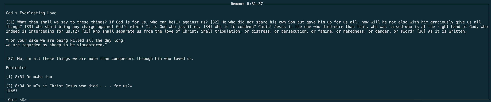

# esv-cli

A command line interface for the ESV API.

## Prerequisites

You must have an API token which should either be stored in a `config.toml`, e.g.:
```toml
esv_api_key = <YOUR API KEY>
```
or as an environment variable, e.g.:
```bash
export ESV_API_KEY=<YOUR API KEY>
```

This could also be stored in a `.env` file in the root directory of this repository, e.g.:
```.env
ESV_API_KEY=<YOUR API KEY>
```

For more information on creating an API token, see the API docs linked below.

## Usage

### Building
```bash 
cargo build --release
export PATH="<PATH/TO/REPO>/esv-cli/target/release:$PATH"
```

### Example
```
$ esv-cli "Romans 8:31-37"
```


## References
1. https://api.esv.org
2. https://api.esv.org/docs/

## Copyright

Scripture quotations are from the ESV® Bible (The Holy Bible, English Standard Version®), © 2001 by Crossway, a publishing ministry of Good News Publishers. Used by permission. All rights reserved. The ESV text may not be quoted in any publication made available to the public by a Creative Commons license. The ESV may not be translated into any other language.

Users may not copy or download more than 500 verses of the ESV Bible or more than one half of any book of the ESV Bible.